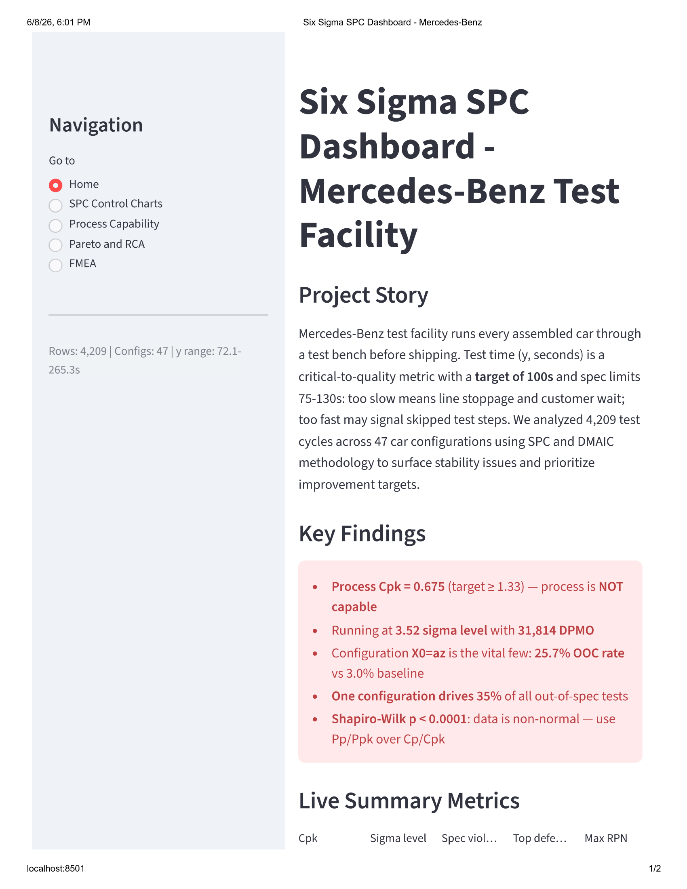
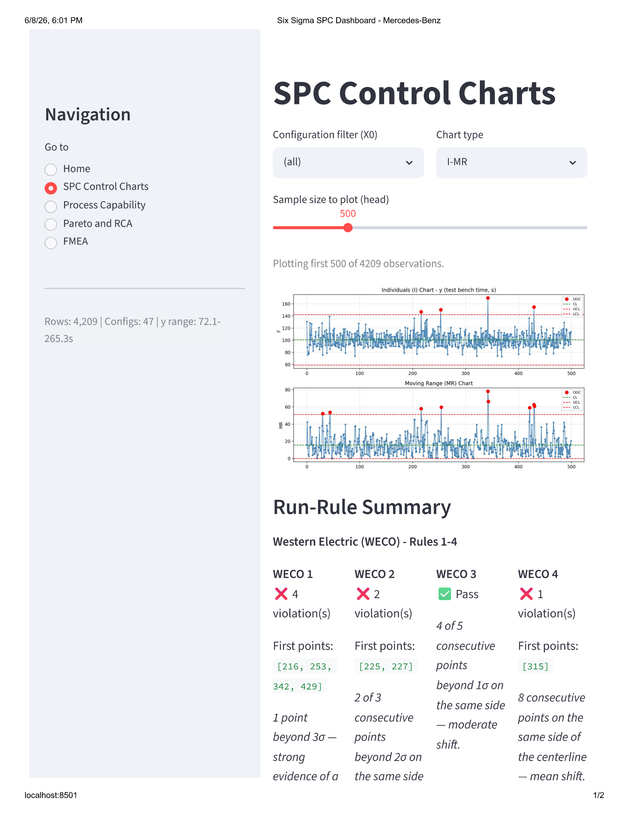
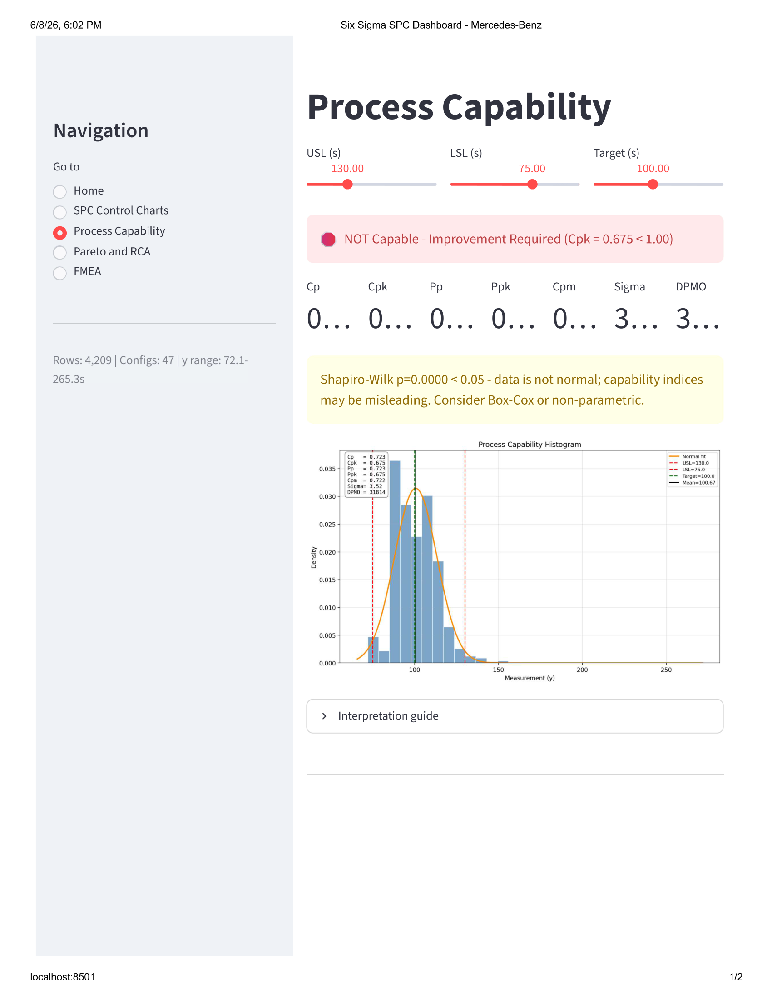
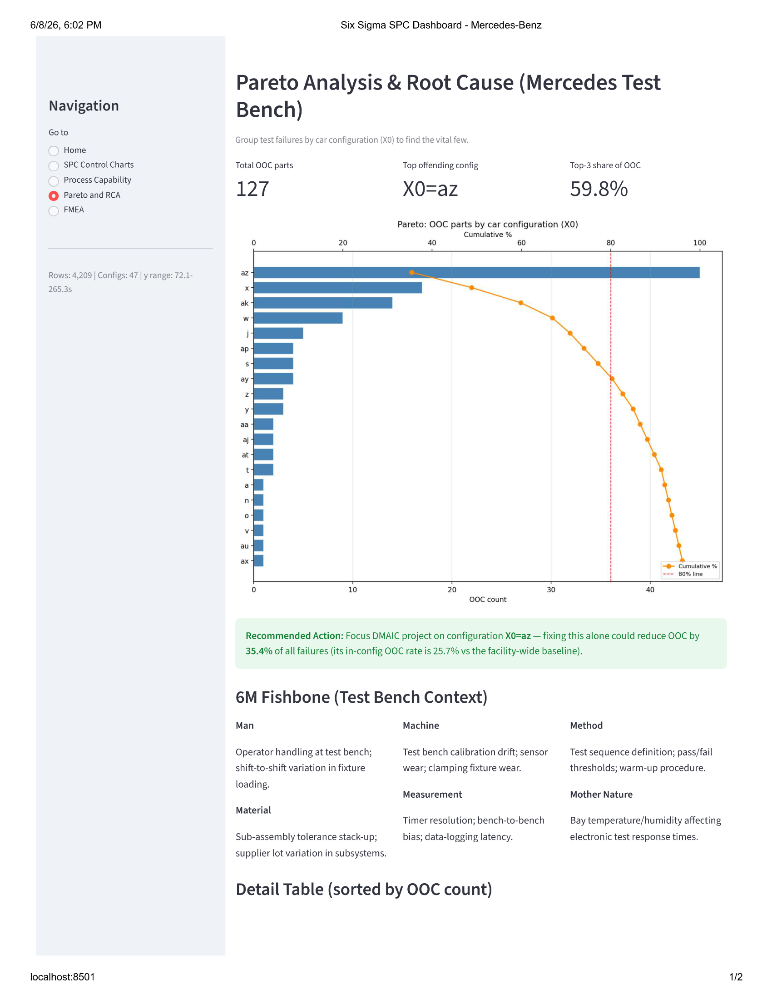
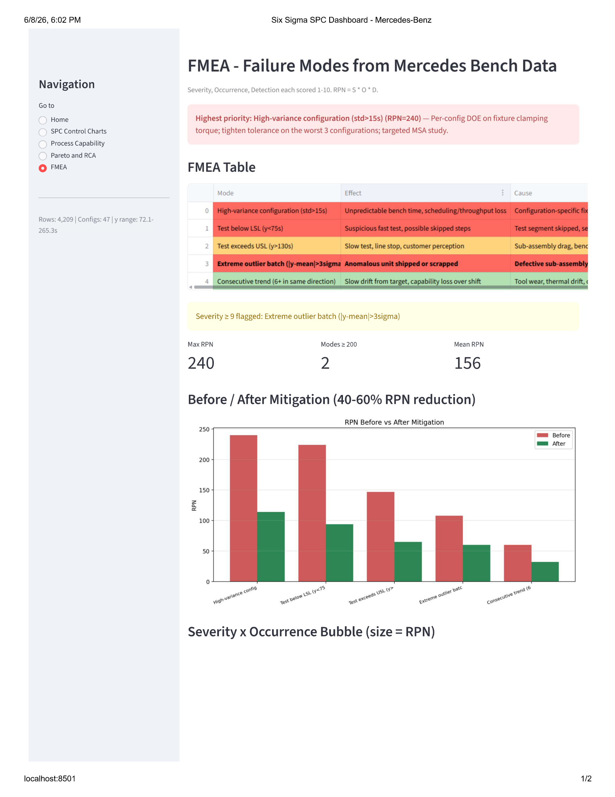

# Six Sigma SPC & Process Capability Dashboard
## Mercedes-Benz Manufacturing Test Bench Analysis

  



## Problem
The Mercedes-Benz assembly facility runs every car through a test bench before shipment. Test cycle time (y, seconds) is a Critical-to-Quality metric: too slow creates throughput bottlenecks; too fast may indicate skipped test steps. Across 4,209 test cycles spanning 47 car configurations, the plant lacked a unified view of test bench stability and capability.

## Solution
A Streamlit dashboard implementing the full DMAIC framework with industry-standard Six Sigma tooling: SPC control charts with WECO + Nelson run-rule detection, process capability analysis (Cp, Cpk, Pp, Ppk, Cpm), Pareto root cause analysis, and a data-derived FMEA with RPN scoring.

## Findings — Current State Assessment

| Metric | Current State | Six Sigma Target | Status |
|--------|--------------|------------------|--------|
| Cpk | 0.675 | ≥ 1.33 | ❌ Not capable |
| Sigma Level | 3.52σ | ≥ 4.5σ | ❌ Below target |
| DPMO | 31,814 | < 1,000 | ❌ High defect rate |
| Worst-config OOC rate | 25.7% (X0=az) | < 3.0% | ❌ Pareto outlier |
| SPC monitoring | None historically | 8 rules live | ✅ Implemented |

**This project completes the Define-Measure-Analyze phases of DMAIC.** The Improve and Control phases (DOE on config "az", pilot fixes, control plan) are the natural next project.

## Key Insights Surfaced
1. **Process is not capable** — Cpk = 0.675 indicates roughly 3.2% of tests fall outside the spec window
2. **One configuration drives 35% of all failures** — X0=az shows a 25.7% OOC rate versus a 3.0% plant baseline
3. **Non-normal distribution detected** — Shapiro-Wilk p < 0.0001; Pp/Ppk preferred over Cp/Cpk for reporting
4. **Stratification signal (Nelson Rule 7)** — 10 instances of 15+ consecutive points within ±1σ suggest variance under-estimation or data filtering
5. **Vital few confirmed** — Top 3 configurations account for 59.8% of all out-of-spec tests

---

## DMAIC Methodology

| Phase | Tools in This Project |
|-------|----------------------|
| **Define** | Project charter, CTQ = test bench time (75-130s), spec limits, target=100s |
| **Measure** | I-MR, X̄-R, X̄-S, EWMA, CUSUM control charts; Cp/Cpk/Pp/Ppk/Cpm |
| **Analyze** | Pareto by X0 config; 6M fishbone; WECO + Nelson run-rule detection |
| **Improve** | FMEA RPN ranking; mitigation prioritization *(execution in next project)* |
| **Control** | Locked spec limits; dashboard-driven SPC monitoring *(execution in next project)* |

---

## Dashboard Tour

### 1. Home — DMAIC Roadmap

Project overview with live metrics, DMAIC phase mapping, and surfaced findings.

### 2. SPC Control Charts

I-MR, X̄-R, X̄-S, EWMA, and CUSUM charts with complete WECO (Rules 1-4) and Nelson (Rules 5-8) run-rule detection. Violating points highlighted in red with explicit point indices.

### 3. Process Capability

Cp, Cpk, Pp, Ppk, Cpm with histogram, normal overlay, and spec limits. Auto-detects non-normality via Shapiro-Wilk.

### 4. Pareto & Root Cause Analysis

Identifies the vital few configurations driving most failures. 6M fishbone for structured root cause investigation. Detail table sorted by OOC count.

### 5. FMEA — Failure Mode & Effects Analysis

5 data-derived failure modes with RPN scoring (S × O × D). Severity≥9 modes auto-flagged regardless of RPN. Action plan column with specific countermeasures.

---

## Tech Stack
- **Python 3.12+**
- **Streamlit** — interactive dashboard
- **Pandas / NumPy / SciPy** — data manipulation and statistics
- **Matplotlib / Seaborn** — control charts and capability plots
- **Plotly** — interactive visualizations

Architecture supports multi-dataset analysis (Steel Plates, AI4I predictive maintenance) via the `ucimlrepo` library — see roadmap section.

## Dataset
- **Source:** [Mercedes-Benz Greener Manufacturing (Kaggle)](https://www.kaggle.com/c/mercedes-benz-greener-manufacturing/data)
- **Size:** 4,209 observations × 376 features
- **Target variable:** `y` (test bench time in seconds)
- **Categorical drivers:** X0-X8 (anonymized car configurations)

---

## Quick Start

```bash
# 1. Clone
git clone https://github.com/YOUR_GITHUB_USERNAME/spc_sixsigma_project.git
cd spc_sixsigma_project

# 2. Install
pip install -r requirements.txt

# 3. Get data
# Download train.csv from Kaggle and place in project root

# 4. Run
streamlit run app.py
# Open http://localhost:8501
```

---

## Project Structure

```
spc_sixsigma_project/
├── app.py                    # Streamlit entry point — Home, SPC, Capability pages + nav
├── requirements.txt          # Python dependencies
├── train.csv                 # Mercedes-Benz dataset (download from Kaggle)
│
├── app_pages/                # Page modules wired into app.py
│   ├── pareto.py             # Pareto chart, 6M fishbone, OOC-by-config table
│   └── fmea.py               # FMEA table, RPN scoring, before/after mitigation
│
├── charts/                   # Reusable chart builders (matplotlib)
│   ├── variables.py          # I-MR, X̄-R, X̄-S, EWMA, CUSUM
│   ├── attributes.py         # p, np, c, u attribute charts
│   └── capability.py         # Cp/Cpk/Pp/Ppk/Cpm + capability histogram
│
├── rules/                    # SPC run-rule detectors
│   ├── weco.py               # Western Electric Rules 1-4
│   └── nelson.py             # Nelson Rules 5-8
│
├── data/                     # Data loading and aggregation helpers
│   └── load_data.py          # load_mercedes, get_ooc_by_config, get_measurement
│
└── screenshots/              # Dashboard screenshots for README
```
